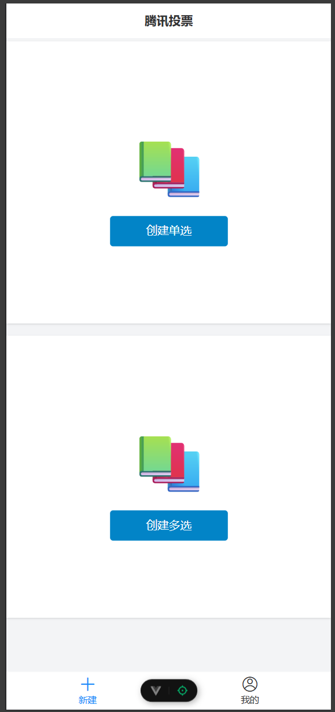
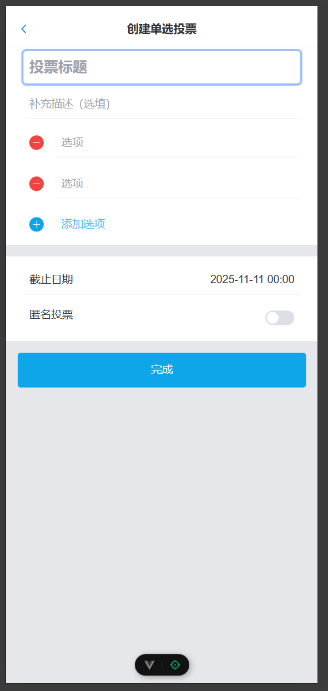
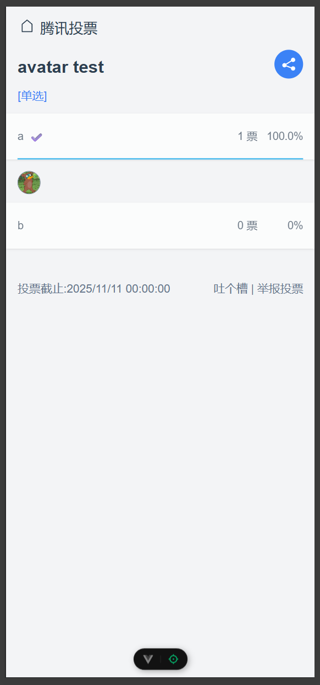
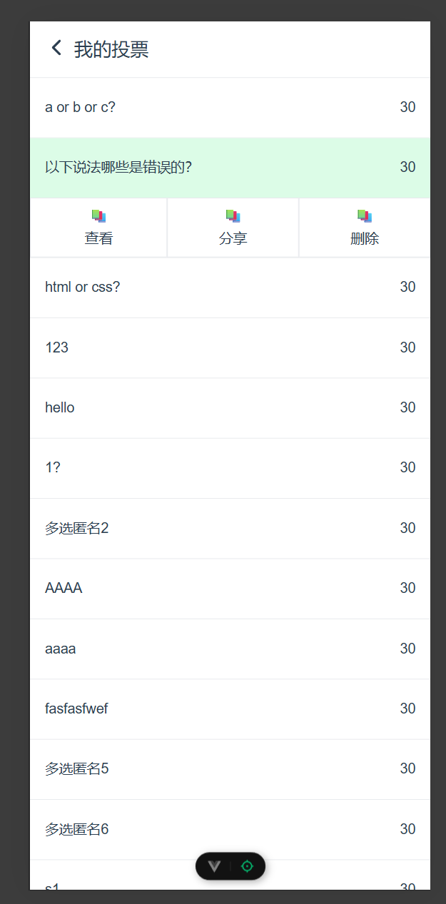

# Vote-Vue3 – 仿腾讯投票平台

## 项目简介

一个基于 Vue3 + Vite + TypeScript 的投票应用，包含登录、投票创建、投票参与、结果展示等完整业务流程。项目以仿真实际线上投票产品为目标，从交互、逻辑到页面结构都贴合真实业务场景。

** 尚未部署到服务器，请看项目实际截图 **

## 🧭 项目概述

这是一个面向业务的前端项目，核心功能包括：

用户登录/注册

投票创建（标题/描述/截止时间/单选多选）

投票参与（投票标题、描述，选择选项、**投票人数动态实时显示**、截止逻辑）

表单验证与数据校验（业务逻辑完整）

模块化组件架构（业务拆分合理，可扩展性高）

**🚀技术栈**

Vue 3（Composition API）：逻辑抽离、复用性强

TypeScript：定义类型、接口、数据模型，提高可维护性

Vite

Vue Router

Pinia：轻量级状态管理

Tailwind CSS：快速原子化样式开发

Vant：使用现有组件库对页面进行UI重构，提高拓展性和可维护性

Axios / Fetch

WebSocket：实时同步投票数据

**🔥功能特性**

* 用户登录 

* 创建投票（多选 / 单选 / 匿名 / 实名）

* 设置投票标题、描述

* 参与投票

* 投票票数占比动态展示

* websocket链接实时更新投票结果

* 投票列表展示，投票编辑/删除/分享功能

**🧠亮点与技术实现**

* 使用 Composition API 进行逻辑组织，更清晰的模块化代码结构

* 投票人数占比实时展示并使用动画过渡效果
  
* 利用 cookie 实现简单的登录状态持久化

* 使用 自定义 Hook（useLogin / useSelectOne / useWindowSize） 抽离业务逻辑，使组件高度复用

* 显示投票用户头像（非匿名投票）

* 投票逻辑严格校验：截止时间禁投/单选 & 多选限制/防止重复提交

* TypeScript 全面使用：对投票实体、选项结构、结果返回等做类型建模，减少运行时错误

* 组件化 + 模块化设计: 逻辑拆分清晰（业务逻辑 Hooks、类型声明、工具类等）

* 真实业务流程完整复刻: 项目覆盖一个投票平台的主要业务链路：创建 → 限制校验 → 参与 → 数据统计

